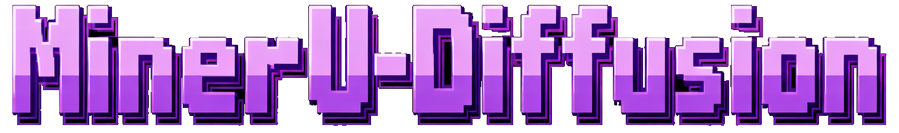

  

# MinerU-Diffusion

  
  
  

**MinerU-Diffusion** is a research-oriented repository for exploring document understanding, generation workflows, and diffusion-driven experimentation under the MinerU umbrella. The project is currently in its bootstrap phase, with the repository prepared for core code, training logic, inference pipelines, and future documentation.

## Overview

This repository is being organized as the foundation for:

- diffusion-based experiments around document or visual content generation
- reusable training and inference pipelines
- project assets, evaluation artifacts, and future technical docs
- a clean base for iterative research and engineering work

## Repository Layout

The current repository is intentionally minimal and ready to expand:

- `assets/` stores visual assets used by the repository, including the README banner
- `README.md` is the project landing page
- `LICENSE` defines the repository license
- `.gitignore` contains baseline ignore rules

## Roadmap

Planned next steps for the repository:

- add the initial project source tree
- define environment and dependency setup
- introduce training or generation entrypoints
- document the intended workflow and examples
- add benchmarks, outputs, or demos as the project matures

## Getting Started

1. Clone the repository.
2. Add the initial project structure for code, configs, and experiments.
3. Document setup instructions once the runtime stack is finalized.
4. Commit incrementally as the research workflow becomes concrete.

## License

This project is released under the MIT License. See [LICENSE](./LICENSE) for details.
